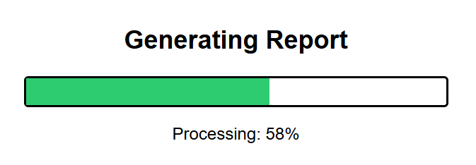

# Launching GeoReports

## URLs

Once installed correctly a GeoReports report can be launched via one of two simple URLs:

- URL that will display a progress bar then the resulting PDF document
- URL that will stream the PDF document directly to the browser

The home page URL at **https://yourdomain/georeports/** displays links to these two types of launch URLs using the sample report.

#### Report with Progress

```nginx
https://yourdomain/georeports/georeport?report=sample&featkey=14335
```

[](images/jgEtEUguMA6tuOBMpcQC.png)

#### Report using a direct stream

```nginx
https://yourdomain/georeports/georeport/direct?report=sample&featkey=14335
```

## Parameters

There are several URL parameters that can be utilised

- **report**  the report configuration file name
- **featkey** feature key to use for spatial queries and database queries
- **datakey** database key to use for spatial queries and database queries
- **refkey** reference key to use for spatial queries and database queries