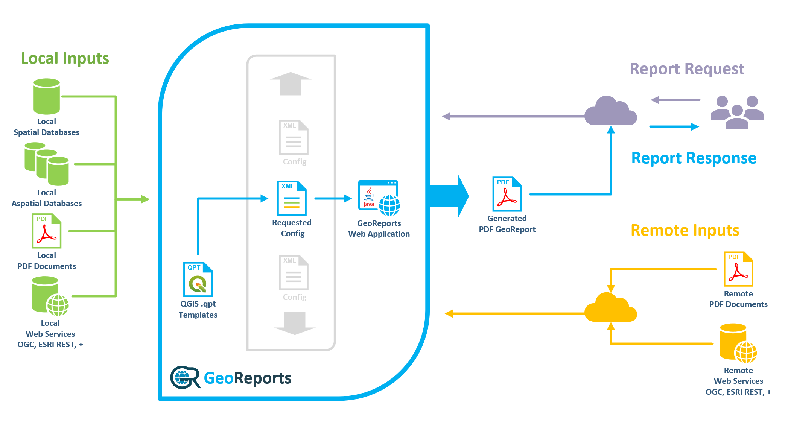

# GeoReports Administrator Manual

## Installation
[Compiling and Packaging the Java Servlet](Installation\compiling-and-packaging-the-java-servlet.md)

[Docker](Installation\docker.md)

[Database Configuration](Installation\database-configuration.md)

## Configuration
[Overview](Configuration\overview.md)

[Settings](Configuration\settings.md)

[Pages - Overview](Configuration\pages-overview.md)

[Page - Foreign Pages](Configuration\page-foreign-pages.md)

[Page - Report Pages](Configuration\page-report-pages.md)

[Page - Report Pages - Map Images](Configuration\page-report-pages-map-images.md)

[Page - Report Pages - Map Images - Scale](Configuration\page-report-pages-map-images-scale.md)

[Page - Report Pages - Map Images - Map Features](Configuration\page-report-pages-map-images-map-features.md)

[Page - Report Pages - Floating Images](Configuration\page-report-pages-floating-images.md)

[Page - Report Pages - Data Tables](Configuration\page-report-pages-data-tables.md)

## Templates
[Creating a QGIS Layout Template](Templates\creating-a-qgis-layout-template.md)

[Adding QGIS Layout Template Components](Templates\adding-qgis-layout-template-components.md)

[Saving the Template to a QPT File](Templates\saving-the-template-to-a-qpt-file.md)

## Application
[Launching GeoReports](Application\launching-georeports.md)

# About GeoReports

GeoReports is a java servlet web application that provides end users with a powerful yet easy to use tool for creating a geographically rich PDF Report containing a series of predefined pages relating to a location of interest. 

An administrator pre-defines one or more GeoReports config files (XML), each defining how a single PDF Report will be constructed.  

A single GeoReports config file contains all the logic required to produce a PDF Report on almost any subject matter.

Examples of subject matter suitable for a GeoReports config file:
* Property Report
* Hazards Report
* LIM (New Zealand Land Information Memorandum)

Each page can contain combinations of maps and/or data derived from local data sources or via web services.

One or more Templates (QGIS QPT Layout Temlates) referenced by the config file define the page layouts required throughout the PDF Report.

Third party PDF documents can be inserted at any point either as defined pages, page ranges or an entire PDF document.

