# Adding QGIS Layout Template Components

To allow GeoReports to extract the correct components and their attributes from a QGIS Layout Template we add various components to the Layout and give each a specific Item Id that GeoReports recognises

[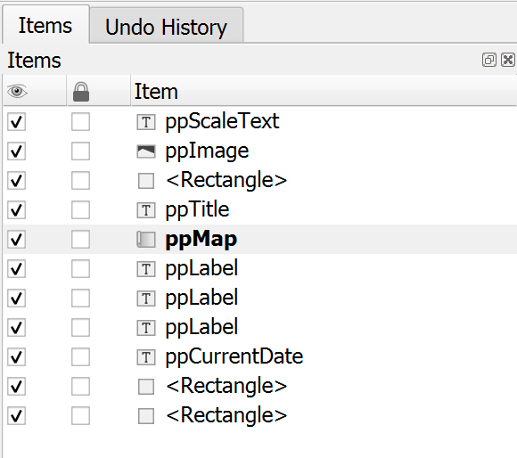](images/3WAFeg2epLLh3P0cXtKW.png)

## Map Image Placeholder

Use the [](images/5vTU8gpLSaz6r8wObb3Q.png) **Add Map** tool to add a new Map item to the page by drawing a rectangle on the layout canvas.

[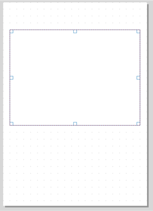](images/Bpk4dEMmYrrDc2sL95Ff.png)


In the **Item Properties** for the Map, set the **Item ID** to 

```ini
ppMap
```

[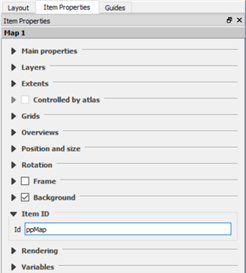](images/VmCSZibO5BxW3Ve6RD0R.png)


## Data Tables Placeholder

Use the [](images/4OqRIu5cpij4wBhKDZtx.png) **Add Label** tool to add a label to the Layout

[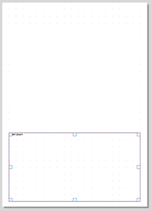](images/0sm3W0D5xs45iJDkxkiN.png)

In the **Item Properties** for the Label, set the **Item ID** to 

```ini
ppData
```

[](images/VmCSZibO5BxW3Ve6RD0R.png)


## Data Table Styles

[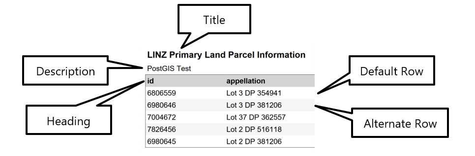](images/GKDKdYZYX96tZ2BXkLkd.png)

GeoReports will automatically style reports for you, however if you wish to customise the tables fonts, border colors, background colors etc. the following placeholders can be added to the QGIS Layout Template and styled accordingly.

---

#### Data Table Title Style Placeholder

Use the [](images/4OqRIu5cpij4wBhKDZtx.png) **Add Label** tool to add a label to the Layout

In the **Item Properties** for the Label, set the **Item ID** to 

```ini
ppDataTableTitleStyle
```

---

#### Data Table Description Style Placeholder

Use the [](images/4OqRIu5cpij4wBhKDZtx.png) **Add Label** tool to add a label to the Layout

In the **Item Properties** for the Label, set the **Item ID** to 

```ini
ppDataTableDescriptionStyle
```

---

#### Data Table Heading Style Placeholder

Use the [](images/4OqRIu5cpij4wBhKDZtx.png) **Add Label** tool to add a label to the Layout

In the **Item Properties** for the Label, set the **Item ID** to 

```ini
ppDataTableHeadingStyle
```

---

#### Data Table Row Default Style Placeholder


Use the [](images/4OqRIu5cpij4wBhKDZtx.png) **Add Label** tool to add a label to the Layout

In the **Item Properties** for the Label, set the **Item ID** to 

```ini
ppDataTableRowDefaultStyle
```

---

#### Data Table Row Alternate Style Placeholder

Use the [](images/4OqRIu5cpij4wBhKDZtx.png) **Add Label** tool to add a label to the Layout

In the **Item Properties** for the Label, set the **Item ID** to 

```ini
ppDataTableRowAlternateStyle
```

---

#### Label properties from the Style Placeholders that GeoReports uses

**Font**

**Font Style (Regular, Bold, Italic and Bold Italic)**

**Font Size**

[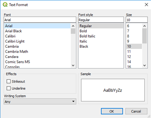](images/WEf529ktiUlKdWzkJAq0.png)


**Font Color**

[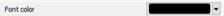](images/z1r1efHPLyWkZcnLoqDd.png)


**Background Color**

[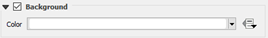](images/zaQ8ndUTmcsoW7mtNjEh.png)


**Frame color**

**Frame Thickness**

[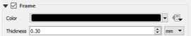](images/ums54wpbSkKOPeRsfahH.png)

---

## Page Borders

Use the [](images/5Ep8uIyQ4Qu2HbWXRAOH.png) **Add Shape** tool and choose [](images/suBg0ruT6hO2CFxE6Oy9.png) **Add Rectangle** then draw a rectangle on the layout canvas.

No **Item ID** is required.

---

## Page Images (Static)

Use the [](images/3qECq6lNC0xQXGVZTUlp.png) **Add Picture** tool to add a new picture to the Layout by drawing a rectangle

Browse for the image in the **Main Properties** section, **Image source**

[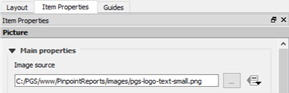](images/i3ys3ik5nDHs0NksN7tS.png)


To control the size of the image, use the **Frame thickness** value (GeoReports multiplies the image width and height by this value)

[](images/ums54wpbSkKOPeRsfahH.png)


In the **Item Properties** for the Image, set the **Item ID** to 

```ini
ppImage
```

---

## Page Images (Dynamic via SQL)


Use the [](images/4OqRIu5cpij4wBhKDZtx.png) **Add Label** tool to add a label to the Layout


In the **Item Properties** tab for the label, change the text for the label to the **SQL statement** required to define the URL for the image…

```postgresql
SELECT imagename FROM schema.table WHERE id=@featurekey
```


Parameters:
- **@featurekey** Replaced with Feature key value from launch URL
- **@databasekey** Replaced with Database key value from launch URL
- **@referencekey** Replaced with Reference key value from launch URL


Only the first column of the first record is returned as the image.

To control the size of the image, use the **Frame thickness** value (GeoReports multiplies the image width and height by this value)

[](images/ums54wpbSkKOPeRsfahH.png)


In the **Item Properties** for the Image, set the **Item ID** to 

```ini
ppImageSQL
```

---

## Single Map Scale Label (for single map on page)


Use the [](images/4OqRIu5cpij4wBhKDZtx.png) **Add Label** tool to add a label to the Layout


Modify the Appearance properties:

**Font**

**Font Style (Regular, Bold, Italic and Bold Italic)**

**Font Size**

[](images/WEf529ktiUlKdWzkJAq0.png)


**Font Color**

[](images/z1r1efHPLyWkZcnLoqDd.png)


**Horizontal Alignment**

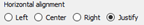

Note **Justify** is not currently supported


In the **Item Properties** for the Image, set the **Item ID** to 

```ini
ppScaleText
```

---

## Page Original Sheet Size Label

Use the [](images/4OqRIu5cpij4wBhKDZtx.png) **Add Label** tool to add a label to the Layout


Modify the Appearance properties:

**Font**

**Font Style (Regular, Bold, Italic and Bold Italic)**

**Font Size**

[](images/WEf529ktiUlKdWzkJAq0.png)


**Font Color**

[](images/z1r1efHPLyWkZcnLoqDd.png)


**Horizontal Alignment**


Note **Justify** is not currently supported


In the **Item Properties** for the Image, set the **Item ID** to 

```ini
ppPageSize
```

---

## Page Printed Date Label


Use the [](images/4OqRIu5cpij4wBhKDZtx.png) **Add Label** tool to add a label to the Layout


Modify the Appearance properties:

**Font**

**Font Style (Regular, Bold, Italic and Bold Italic)**

**Font Size**

[](images/WEf529ktiUlKdWzkJAq0.png)


**Font Color**

[](images/z1r1efHPLyWkZcnLoqDd.png)


**Horizontal Alignment**


Note **Justify** is not currently supported


In the **Item Properties** for the Image, set the **Item ID** to 

```ini
ppCurrentDate
```

---

## Page Labels (Static)


Use the [](images/4OqRIu5cpij4wBhKDZtx.png) **Add Label** tool to add a label to the Layout


In the **Item Properties** tab for the label, change the text for the label to the text to be returned

```ini
This is some static text
```


Modify the Appearance properties:

**Font**

**Font Style (Regular, Bold, Italic and Bold Italic)**

**Font Size**

[](images/WEf529ktiUlKdWzkJAq0.png)


**Font Color**

[](images/z1r1efHPLyWkZcnLoqDd.png)


**Horizontal Alignment**


Note **Justify** is not currently supported


In the **Item Properties** for the Image, set the **Item ID** to 

```ini
ppLabel
```

---

## Page Labels (Dynamic via SQL)


Use the [](images/4OqRIu5cpij4wBhKDZtx.png) **Add Label** tool to add a label to the Layout

In the **Item Properties** tab for the label, change the text for the label to the **SQL statement** required to define the text to be returned…

```postgresql
SELECT text FROM schema.table WHERE id=@featurekey
```


Parameters:
- **@featurekey** Replaced with Feature key value from launch URL
- **@databasekey** Replaced with Database key value from launch URL
- **@referencekey** Replaced with Reference key value from launch URL


Only the first column of the first record is returned as the text.

Modify the Appearance properties:

**Font**

**Font Style (Regular, Bold, Italic and Bold Italic)**

**Font Size**

[](images/WEf529ktiUlKdWzkJAq0.png)


**Font Color**

[](images/z1r1efHPLyWkZcnLoqDd.png)


**Horizontal Alignment**


Note **Justify** is not currently supported


In the **Item Properties** for the Image, set the **Item ID** to 

```ini
ppLabelSQL
```

---

## Page Title Label


Use the [](images/4OqRIu5cpij4wBhKDZtx.png) **Add Label** tool to add a label to the Layout


Modify the Appearance properties:

**Font**

**Font Style (Regular, Bold, Italic and Bold Italic)**

**Font Size**

[](images/WEf529ktiUlKdWzkJAq0.png)


**Font Color**

[](images/z1r1efHPLyWkZcnLoqDd.png)


**Horizontal Alignment**


Note **Justify** is not currently supported


In the **Item Properties** for the Image, set the **Item ID** to 

```ini
ppTitle
```
