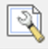
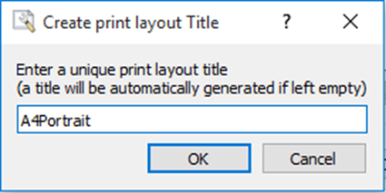
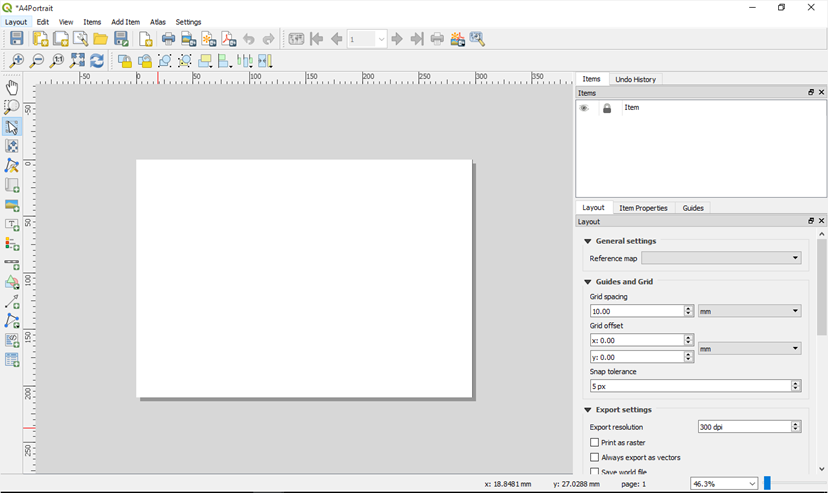
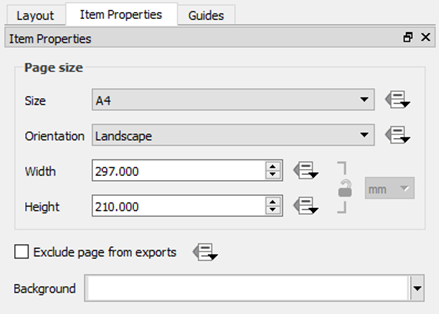
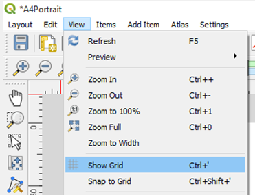

# Creating a QGIS Layout Template

Create a new Map Layout as an A4 Portrait page…

  
Launch the **Layout Manager** from the toolbar using the  tool  
Click the **Create** button  
Give the Layout a Title

Click the **OK** button.

The Layout window will open with a blank page.

**Right click** the blank page and choose **Page Properties**…

Set the **Size** to **A4**  
Set the **Orientation** to **Portrait**

Setup a grid to help place items on the page

Enable grids through the menu **View** ‣ **Show Grid**

Enable snap to grids through the menu **View** ‣ **Snap to Grid**